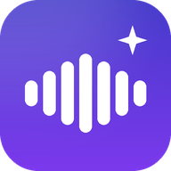

# AiNotetaker

A self-hosted voice recorder, transcriber and note-taker: a native **iPhone app**
(SwiftUI) backed by a small **FastAPI server** you run on your own machine. Record
in any language, get a cleaned-up copy of the audio, an accurate transcript, and an
AI summary — without your recordings passing through anyone's product but your own.

<p align="center"></p>

- 🎙️ **High-quality recorder** — 24-bit Apple Lossless at the microphone's native rate
  with iOS signal processing off, automatic best-microphone selection, and it keeps
  recording while the phone is locked or you switch apps.
- 🌍 **Multilingual speech-to-text** — the language is auto-detected by default, and a
  speaker who switches language mid-sentence is followed. Every language is written in
  its own script, never translated. Set `TRANSCRIBE_LANGUAGE` to bias one language if
  you always record in the same one.
- 🔇 **Noise removal** — the server keeps a cleaned copy of every recording
  (DeepFilterNet when installed, otherwise a lightweight spectral denoiser). The
  original file is never modified.
- 🧠 **AI analysis & reports** — each transcript gets a title, summary, key points,
  decisions, action items, people and open questions; a Markdown report can be built
  across many notes at once.
- 📝 **Notes** — a synced notes list. Right-to-left and left-to-right text align
  correctly, including when they are mixed in one note.
- 🔒 **Private by design** — audio goes only to *your* server, which forwards it to the
  transcription provider you configured. Nothing is published anywhere.

---

## How it fits together

```
 iPhone (native app)                    Your server (FastAPI)                       Model provider
 ───────────────────                    ─────────────────────                       ──────────────
 record (ALAC 48 kHz, background) ──▶  store original
 upload when done                       ├─ decode → noise-removed copy (FLAC)
                                        ├─ split into ≤10-min 16 kHz FLAC chunks ──▶  audio model → transcript
                                        ├─ stitch transcript
                                        └─ analyze transcript (text only) ──────────▶  chat model → title, summary,
 play original / cleaned  ◀──────────── results                                       key points, action items
 transcript · analysis · notes · reports
```

A progressive web app ships alongside and works as a second client from any browser.

---

## Part 1 — The server

Runs on macOS (where the iOS toolchain lives) and on Linux. Python 3.11+.

```bash
git clone https://github.com/shosseini811/AiNotetaker-iOS.git AiNotetaker
cd AiNotetaker
python3 -m venv .venv && source .venv/bin/activate
pip install -r requirements.txt          # includes a bundled ffmpeg — nothing to brew

cp .env.example .env
# Edit .env and set:
#   OPENROUTER_API_KEY = your key from https://openrouter.ai/keys
#   API_TOKEN          = a secret for the iPhone app, e.g.:  openssl rand -hex 24
#   APP_PASSWORD       = a password for the web app (optional; the token works too)

./run.sh
```

The startup banner reports what is configured: login mode, iPhone token,
voice-to-text, noise removal and AI analysis.

**Strongly recommended — much better noise removal.** DeepFilterNet is a neural
denoiser that runs in real time on CPU (roughly 18× realtime on an M1, no GPU
needed). On a real recording it removed **26 dB** of background noise while
changing the voice by only 0.5 dB; the default lightweight denoiser removed
14 dB and dulled the voice by 8 dB. One command installs it as a standalone
binary — no PyTorch:

```bash
./scripts/install-deepfilter.sh
# DENOISE_ENGINE=auto (the default) picks it up automatically on restart.
```

### Private access from anywhere

Install and sign in to [Tailscale](https://tailscale.com) on both the server
machine and the iPhone, then run once on the server (macOS):

```bash
./scripts/setup-remote-access.sh
```

The script creates one permanent private HTTPS address, ensures the iPhone API
token exists, and binds the server to localhost so Tailscale Serve is the only
remote entry point. Paste the printed address and token into the app's Settings.
The same address works on home Wi-Fi, other networks, and cellular — no router
port-forwarding, and Tailscale Funnel is never enabled.

**You only ever have to enter one address.** The server reports every address it
answers on — the Tailscale HTTPS name, the plain MagicDNS name, its LAN address —
to any client that already holds the API token. The app saves them and, on each
network change, sends its next request to whichever one actually responds,
preferring the one that survives leaving the house. An app set up long ago on a
`192.168.1.x` address starts working on cellular by itself the first time it
reaches the server at home, and the address you typed keeps working as a fallback
if Tailscale is ever off. *Settings → Access Anywhere* shows what it learned and
which address the current connection uses.

On the iPhone, open Tailscale → profile picture → **VPN On Demand** and choose
**Always** for both Wi-Fi and Cellular. If the phone is temporarily offline, the
app keeps the lossless original locally, labels it *Waiting for connection*, and
retries when it is back online.

### Keeping it running (macOS)

launchd starts the server at login and restarts it if it crashes. A template
lives at `scripts/com.ainotetaker.server.plist`:

```bash
mkdir -p ~/Library/LaunchAgents
sed "s|__HOME__|$HOME|g" scripts/com.ainotetaker.server.plist \
  > ~/Library/LaunchAgents/com.ainotetaker.server.plist
launchctl bootstrap gui/$(id -u) ~/Library/LaunchAgents/com.ainotetaker.server.plist
```

Verify it is healthy:

```bash
launchctl print gui/$(id -u)/com.ainotetaker.server | grep -E "state|pid"
curl -s http://localhost:8000/api/config          # should return JSON
tail -f ~/Library/Logs/ainotetaker.log            # live logs (Ctrl+C to stop)
```

After editing `.env`, apply it with
`launchctl kickstart -k gui/$(id -u)/com.ainotetaker.server`. To remove the
service entirely: `launchctl bootout gui/$(id -u)/com.ainotetaker.server`.

**Keep the machine awake.** A Mac used as an always-on server should not sleep,
or the phone cannot reach it:

```bash
sudo pmset -a sleep 0 disablesleep 1     # never sleep while on power
```
(Undo with `sudo pmset -a sleep 10 disablesleep 0`.)

---

## Part 2 — The iPhone app

Plain SwiftUI, iOS 17+. The Xcode project is generated from `ios/project.yml`, so
it is never committed — regenerate it instead of editing project settings by hand.

1. **On a Mac:** install Xcode from the App Store, then `brew install xcodegen`.
2. **Generate & open the project:**
   ```bash
   cd ios
   ./generate.sh
   open AiNotetaker.xcodeproj
   ```
3. **Sign it with your Apple ID** (a free account is enough): Xcode → Settings →
   Accounts → add your Apple ID. Then select the `AiNotetaker` target → *Signing &
   Capabilities* → Team: your personal team. Because XcodeGen rewrites the project
   on every generate, the durable place for your team is `ios/Config/Local.xcconfig`
   (git-ignored; `./generate.sh` creates it from the example on first run).
4. **Pick your own bundle ID.** The repo ships `com.example.ainotetaker`, which
   Apple will not let you register. Change `PRODUCT_BUNDLE_IDENTIFIER` and
   `bundleIdPrefix` in `ios/project.yml` to your own reverse-DNS prefix, then
   re-run `./generate.sh`.
5. **Install on the phone:** plug in the iPhone, pick it as the run destination,
   press **Run (⌘R)**. Or, once a signing team is set,
   `cd ios && ./deploy_to_device.sh` builds Release and installs it to a paired
   iPhone from the command line.
6. **First-time iPhone setup** (once):
   - *Settings → Privacy & Security → Developer Mode* → on (the phone restarts).
   - *Settings → General → VPN & Device Management* → trust your developer app.
7. **Point the app at your server:** open the app → *Settings* → enter the server
   URL and the `API_TOKEN` from your `.env` → **Test connection**.

**About the free Apple ID:** apps signed with a free account expire after **7 days**.
Re-run from Xcode to renew; recordings and settings on the phone are kept. The paid
Apple Developer Program extends this to a year and enables TestFlight.

---

## Using the app

| Tab | What it does |
|---|---|
| **Record** | Big red button, live level meter and timer, pause/resume. Keeps recording with the screen locked. On stop, the recording is saved to the Library and (by default) uploaded for cleaning and transcription. |
| **Library** | All recordings with status badges. Tap one to play the **original or the noise-removed copy**, read or correct the transcript, and review the AI memory: summary, key points, decisions, action items, people and open questions. Corrections refresh the memory atomically. Re-run processing, share, or **save the transcript as a note**. Swipe to delete (also deletes on the server). The toolbar button builds an **AI report**. |
| **Notes** | Notes synced with the server. Search, pin, edit. Right-to-left and left-to-right scripts align correctly, even when mixed in one note. |
| **Settings** | Server address and token, Wi-Fi/cellular status, which address the app is connected through, connection test, system health, and auto-upload. |

---

## Getting the best audio quality

The app is built to capture the truest signal the phone can give:

| What | How |
|---|---|
| Lossless, 24-bit | Apple Lossless (bit-perfect), 24-bit depth, written at the microphone's **native** sample rate so nothing is resampled. iPhone mics run at 48 kHz, which already captures everything the human voice produces. |
| Raw signal | The audio session runs in `.measurement` mode: iOS's automatic gain, EQ and noise suppression are **off**. The original file is never processed; noise removal happens on the server, on a separate copy (also 24-bit). |
| Best microphone wins | Inputs are ranked **USB / Lightning audio interface → wired mic → built-in mics**, and the choice is re-asserted if you plug something in mid-recording. |
| No Bluetooth degradation | Bluetooth headset mics use a narrowband phone-call codec, so they are **off by default** and a headset cannot silently take over the recording. Opt in under Settings → Microphone. |
| Pickup pattern | *Voice* mode uses the bottom mic with a **cardioid** pattern, which rejects room noise; *Room* mode uses an omnidirectional pattern for meetings; *Automatic* leaves iOS's default. The live input, rate and depth are shown under the timer. |

**Practical tips that matter more than any setting**
- The single biggest upgrade is an **external wired microphone** (USB-C/Lightning
  lavalier, shotgun, or an audio interface). The app selects it automatically.
- Keep the phone **15–30 cm** from your mouth, mic uncovered (some cases block the
  bottom mic), and avoid handling the phone while recording. If the app warns that
  the input is too loud, move farther away — digital clipping cannot be repaired.
- Install DeepFilterNet (`./scripts/install-deepfilter.sh`); it is the single
  biggest improvement to the cleaned copies. `DENOISE_STRENGTH` only affects the
  fallback denoiser.
- Transcription deliberately reads the **original** audio, not the cleaned copy.
  Denoising can turn one word into a similar-sounding different word, and modern
  speech models handle moderate noise well. The cleaned copy is for listening.

---

## Configuration (`.env`)

| Variable | Default | Purpose |
|---|---|---|
| `OPENROUTER_API_KEY` | — | **Required** for transcription and analysis. |
| `OPENROUTER_MODEL` | `google/gemini-3.8-flash` | Audio-capable model that transcribes. |
| `OPENROUTER_TEXT_MODEL` | `google/gemini-3.8-flash` | Chat model for analysis and reports. |
| `TRANSCRIBE_LANGUAGE` | — (auto) | Optional ISO 639-1 hint (`en`, `es`, `fr`, `de`, `fa`, `hi`, `ja`, …). Empty auto-detects and follows mid-recording language switches. |
| `TRANSCRIBE_VOCABULARY` | — | Comma-separated exact spellings for names, clients, companies, acronyms and technical terms the model may hear. |
| `ANALYSIS_LANGUAGE` | `auto` | Language of summaries/reports; `auto` = same as the content. |
| `TRANSCRIBE_CHUNK_SECONDS` | `600` | Chunk length for long recordings (audio is sent inline, ~20 MB/request). |
| `TRANSCRIBE_AUDIO_FORMAT` | `flac` | Chunk format sent to the model (`flac` or `wav`). |
| `TRANSCRIBE_PROVIDER` | `openrouter` | Primary transcription engine: `openrouter`, `azure-mai`, or `openai`. |
| `TRANSCRIBE_FALLBACK_PROVIDER` | — | Optional automatic fallback if the primary speech service is unavailable. |
| `AZURE_SPEECH_ENDPOINT` / `AZURE_SPEECH_KEY` | — | Azure Speech credentials for optional `MAI-Transcribe-2`. |
| `AZURE_SPEECH_DIARIZATION` | `1` | With MAI-Transcribe-2, identify speakers and add timestamps. |
| `DENOISE_ENGINE` | `auto` | `auto` (best available) / `deepfilter-bin` / `deepfilternet` / `noisereduce` / `off`. |
| `DEEPFILTER_BIN` | — | Path to the `deep-filter` binary; PATH and `~/.local/bin` are searched when empty. |
| `DEEPFILTER_POSTFILTER` | `0` | Stronger suppression for unusually noisy audio; off preserves the most natural voice. |
| `DENOISE_STRENGTH` | `0.8` | Attenuation of the lightweight denoiser, 0.0–1.0 (DeepFilterNet ignores it). |
| `API_TOKEN` | — | Bearer token for the iPhone app. |
| `APP_PASSWORD` | — | Web app password. Either secret works in either place. |
| `MAX_UPLOAD_MB` | `2048` | Largest accepted recording. |
| `HOST` / `PORT` | `0.0.0.0` / `8000` | Bind address. |
| `PUBLIC_URL` | — | Address clients should save for reaching this server from anywhere. Empty = discovered (Tailscale Serve, then MagicDNS). Set it for your own domain or reverse proxy. |
| `DATA_DIR` | `data` | Database, recordings and secrets. |

**Optional Microsoft transcription.** `TRANSCRIBE_PROVIDER=azure-mai` uses
MAI-Transcribe-2 for speaker-aware meeting transcripts with vocabulary hints and
timestamps. Leave the locale empty for automatic language detection. Keep
`TRANSCRIBE_FALLBACK_PROVIDER=openrouter` for resilience. Requires an Azure Speech
resource; not enabled by default.

**Alternative speech-to-text backend.** `TRANSCRIBE_PROVIDER=openai` talks to any
OpenAI-compatible `/audio/transcriptions` endpoint (OpenAI Whisper, or Groq's fast
`whisper-large-v3`) — see the comments in `.env.example`.

---

## Privacy & storage

- **Leaves the phone:** the recording, to *your* server only.
- **Leaves the server:** audio chunks to the transcription provider you configured
  (OpenRouter by default, optionally Azure or an OpenAI-compatible endpoint), and
  transcript *text* to the chat model for analysis and reports. Nothing else.
- **Stored on the phone:** the lossless original (Documents/Recordings), transcript,
  analysis.
- **Stored on the server:** `data/recordings/` (originals plus `*.clean.flac` copies),
  `data/ainotetaker.db` (notes, transcripts, analyses), `data/.secret_key`.
- **Backup:** copy the `data/` folder. Lossless 48 kHz mono is roughly 170 MB/hour.

Nothing under `data/`, no `.env`, and no certificate or key is ever committed — see
`.gitignore`.

Long-meeting analysis is hierarchical: every section is extracted and the results are
then consolidated, instead of silently summarizing only the beginning.

---

## The web app (optional second client)

Open the server URL in any browser for the PWA: notes plus quick dictation. **Its
microphone needs HTTPS** (a browser rule) — either `./scripts/gen_cert.sh` for a
self-signed certificate, or Tailscale's built-in HTTPS (`tailscale serve`). The
native iPhone app has no such requirement.

---

## Troubleshooting

- **Xcode: "Failed to register bundle identifier"** — change the bundle ID in
  `ios/project.yml` to your own prefix and regenerate.
- **iPhone: "Untrusted Developer"** — Settings → General → VPN & Device Management → trust.
- **App stopped after 7 days** — free-account signing expired; run again from Xcode.
- **Recording didn't continue in the background** — make sure the app was not
  force-quit; background audio is enabled in `Info.plist` (`UIBackgroundModes: audio`).
- **Only works on home Wi-Fi** — run `./scripts/setup-remote-access.sh` on the server
  and enable Tailscale VPN On Demand on the iPhone for Wi-Fi and Cellular. You do not
  have to re-type the address: open the app once while still on home Wi-Fi and it
  learns the `*.ts.net` address from the server. If *Settings → Access Anywhere*
  still says *Same Wi-Fi only*, the server has no remote address yet — check the
  `Away from Wi-Fi` line in its startup banner.
- **Upload is waiting for connection** — the original is safe on the iPhone. Confirm
  Tailscale is connected on both devices and the server machine is awake; the app
  retries automatically while open and when it returns to the foreground.
- **Upload fails** — check the server address and API token in Settings →
  *Test connection*; check `MAX_UPLOAD_MB` for very long recordings.
- **Transcription error** — the server log shows the provider's message; verify the
  key and that `OPENROUTER_MODEL` accepts audio input.
- **Noise removal shows "off"** — `pip install -r requirements.txt` (noisereduce) or
  install DeepFilterNet as above; check `DENOISE_ENGINE`.
- **Right-to-left text looks left-aligned** — alignment follows the first strong
  character of the text, so a note starting with digits or Latin punctuation leads.
- **Can it record a phone call?** No — and neither can any third-party iOS app.
  During a call iOS gives the microphone exclusively to the Phone app. Use the Phone
  app's built-in call recording (iOS 18+), then share the file in.
- **Can it record music playing on the phone?** Not a clean copy — iOS forbids apps
  from capturing other apps' audio. Turn on Settings → *Keep other audio playing
  while recording* and the music keeps playing while the mic records it from the
  speaker (room quality). That mode also switches the audio session from
  `.measurement` to `.default`, because iOS quietens system output under
  `.measurement`.

---

## Project layout

```
AiNotetaker/
├── app/                       # FastAPI server
│   ├── main.py                #   API: notes, recordings pipeline, analysis, reports, web app
│   ├── audio.py               #   ffmpeg decode/chunking, DeepFilterNet / noisereduce
│   ├── transcription.py       #   chunked multilingual STT, provider fallback
│   ├── analysis.py            #   summaries, action items, cross-note reports
│   ├── network.py             #   the addresses this machine answers on (Tailscale, LAN)
│   └── db.py · auth.py · config.py
├── ios/                       # Native iPhone app (SwiftUI, iOS 17+)
│   ├── project.yml            #   XcodeGen spec → AiNotetaker.xcodeproj
│   └── AiNotetaker/
│       ├── Services/          #   Recording, networking, API client, resilient sync
│       ├── Views/             #   Record, Library, Detail, Notes, Report, Settings
│       └── Models/
├── web/                       # Web app (PWA), no build step
├── scripts/                   # Tailscale setup, TLS cert, DeepFilterNet installer, launchd
├── tests/test_server.py       # end-to-end server tests (synthetic ALAC, mocked providers)
├── .github/workflows/ci.yml   # server tests on Linux + iOS compile check on macOS
└── run.py · run.sh · requirements*.txt · .env.example
```

## Development

```bash
pip install -r requirements.txt -r requirements-dev.txt
python -m pytest -q tests
```

CI runs the server test suite on Linux and compiles the iOS app on a macOS runner
for every push and pull request.

## License

[MIT](LICENSE).
